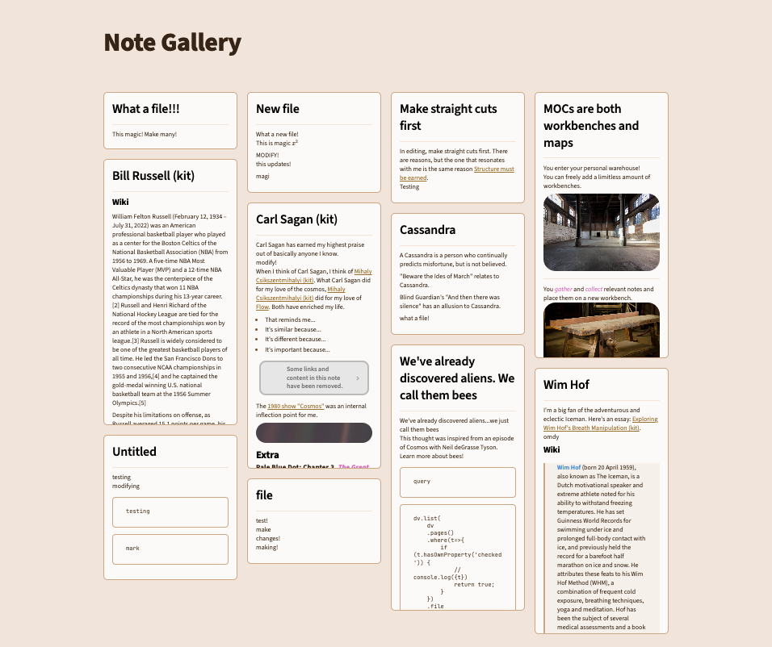

# What is it?
Note Gallery is a [super-fast] masonry style note gallery for [Obsidian](https://obsidian.md/).

- This plugin is currently in early alpha testing. It's functional but may contain some bugs.
- Please feel free to leave any bugs or feature requests in issues.
- I've tested this with a couple thousand notes and so far, I've been getting near-instant previews!

[](https://github.com/sponsors/pashashocky)
[](https://www.buymeacoffee.com/pashashocky)

# Functionality
## Current
- Displays notes or images using a masonry gallery by defining a code block in your note. Similar to "Safari overview mode" or "Craft-like folder view".
  - [x] Opimized the loading of markdown cards through caching.
  - [x] CRUD operations update the gallery.
- Variety of filtering and searching options
  - [x] `query` supports native obsidian search syntax! Only include 1 (one) `query` argument in your code block. For example, here are several individual query examples you could use:
    - `query: '/(Regex: \d)/'`
    - `query: 'path: Atlas tag: #mytag'`
    - `query: 'path: abc/deb OR path: atlas/notes'`
    - `query: path:abc/deb OR path:atlas/notes` - notice the spacing differences without quotes
  - [x] `path` can be used to select an individual folder or recursively collect it
- Has options for sorting, limiting # of results and recursively scanning folders.
- Custom breakpoints for gallery columns

## Work in Progress
- Actively working through issues.
- Interactive view when clicking on folders in the file switcher.
- Showing currently open tabs as a Masonry gallery.

## Quickstart
To get an idea of how syntax works, create a new blank note and copy/paste this entire syntax block into the note. Your masonry layout should show up right away. In this example, it will show your most recent 9 notes. If they do not show up immediately, create a new line in your note outside of the syntax block.

When copying and pasting, be sure to include all 4 `~` characters at the beginning and all 4 `~` characters at the end of the syntax block.

```
~~~~note-gallery
sort: desc
limit: 9
~~~~
```

## Example Syntax
```
~~~~note-gallery            # default | options

# QUERY OPTIONS

# query can be anything compatible with obsidian's search
# make sure to wrap in single quotes for any regex e.g.: '/\d/'
query: 'tag:#mytag'      

# display native search results to debug
debugQuery: false           # false | true

# PATH OPTIONS

# a path in your vault to source notes and media from
# path and query can be used together to combine the sources
path: atlas                 # current note folder | path/to/folder

# search subfolders of path recursively
recursive: true             # true | false

# include media attachment files from the configured path
includeImageFiles: true     # true | false
includeVideoFiles: true     # true | false
includeAudioFiles: true     # true | false

# SORTING OPTIONS

# descending or ascending order
sort: desc                  # desc | asc

# sort by modified time, created time, or filename
sortBy: mtime               # mtime | ctime | name

# randomly sorts the cards, overrides other sorting options
sortRandom: false           # false | true

# DISPLAY OPTIONS

# maximum number of cards to display, set to 0 for no limit
limit: 20                   # 20 | any number

# font size of note content
fontSize: 6pt               # 6pt | NUMBERpt | NUMBERpx

# maximum height of cards, set to auto for no limit
maxHeight: 330px            # 330px | NUMBERpx | auto

# show the note title at top of card
showTitle: true             # true | false

# set breakpoints for number of columns
breakpoints:
  default: 4
  100000: 10
  3500: 10
  3100: 9
  2700: 8
  2300: 7
  1900: 6
  1500: 5
  1000: 4
  700: 3
  400: 2
  200: 1
~~~~
```

## Responsive Breakpoints

Different columns can be specified by passing an object containing key's of the window widths and their value as the number of columns. To have a fallback value, use the `default` key.

```
breakpoints:
  default: 4,
  1100: 3,
  700: 2,
  500: 1
```

# Installation Instructions
## Community Plugin
You can now install `Note Gallery` from community plugins of Obsidian!

## BRAT
1. Install BRAT from the Community Plugins in Obsidian
  1.1 Enable the BRAT plugin in the settings
2. Open the command palette (CMD/CTRL + P) and run the command BRAT: `Add a beta plugin for testing`
3. Enter the following URL: `https://github.com/pashashocky/obsidian-note-gallery`
4. Enable the `Note Gallery` plugin in the `Community Plugins` tab in settings
5. Create a code block similar to the below in any of your notes
